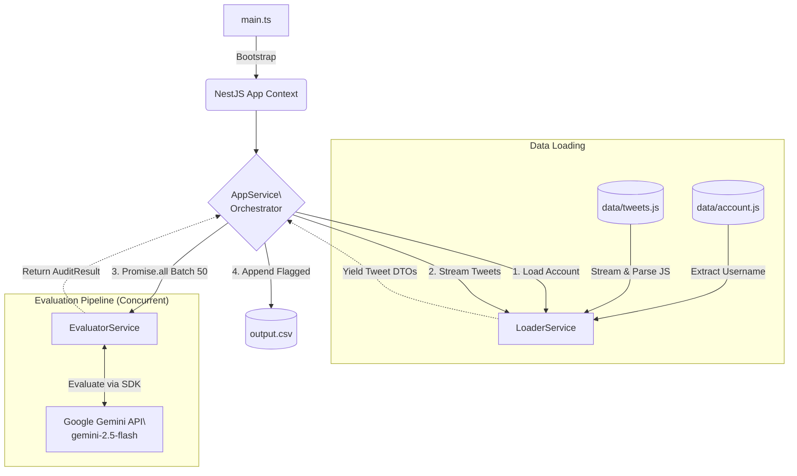

# Tweet Audit (NestJS Standalone)

NestJS-based CLI tool for analyzing and flagging tweets from your Twitter/X archive using the Google Gemini API.

## 🏗️ Architecture

This project runs as a **NestJS Standalone Application**, meaning it utilizes the powerful Dependency Injection (DI) system and modularity of NestJS without spinning up an HTTP server.




### Flow Description

1. **Extraction**: Reads your Twitter archive (`account.js` and `tweets.js`), bypassing the raw JavaScript wrapping, and parses the internal JSON.
2. **Transformation**: Maps raw JSON data into typed `Tweet` models using an efficient JavaScript Generator pattern to stream data and keep memory usage low.
3. **Evaluation**: Groups tweets into batches of 50 and executes concurrent evaluation requests against the `gemini-2.5-flash` model. Uses RxJS to handle exponential backoff and retries gracefully.
4. **Loading**: Writes flagged tweets (tweets that meet your deletion criteria) directly to an `output.csv` file for manual review.

---

## 🚀 Getting Started

### Prerequisites

* **Node.js** (v16 or higher)
* **npm** (v8 or higher)
* A valid **Google Gemini API Key**

### 1. Installation

Clone the repository and install dependencies:

```bash
npm install

```

### 2. Prepare Your Data

Create a `data` directory at the root of the project and copy your exported X/Twitter archive files into it. The script specifically looks for:

* `data/account.js`
* `data/tweets.js`

### 3. Environment Configuration

Create a `.env` file in the root directory and add your Google API key:

```env
GOOGLE_API_KEY=your_gemini_api_key_here

```

---

## ⚙️ Configuration

You can customize the evaluation criteria by editing `src/evaluator/criteria.constants.ts`.

The current criteria checks for:

* **Forbidden words**: e.g., "crypto", "NFT", "hustlegrindset".
* **Professionalism**: Flags inappropriate slang, aggressive language, or crude humor.
* **Tone**: Ensures tweets match a "respectful and thoughtful" tone.
* **Politics**: Flags polarized political opinions.
* **Old opinions**: Flags absolutist statements and overconfident takes.

---

## 🏃‍♂️ Running the Audit

Start the evaluation process by running:

```bash
npm run start

```

### What to expect:

The application will output log statements to your console as it reads the archive, processes batches of tweets, and handles rate limiting. Once the process is finished (or as batches complete), it will generate an `output.csv` file containing the URLs of any tweets that the AI flagged for deletion.
